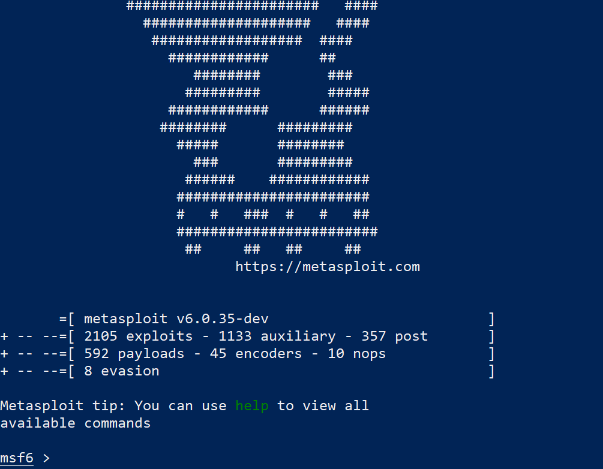

## What is Docker?

Docker is a very prominent **container solution**. A whole system can be created easily (without any extra need of installments) and can be run anywhere that supports such a container. 

A **container** contains all the libraries and dependencies that an application needs to run, thus eliminating the requirement for manual installations.

This is why docker is now-a-days widely used in software **development and deployment**.

## Docker vs Virtual Machine

Docker is a container based technology, whereas a Virtual Machine is not.

**Docker** containers just utilize the **user space** of the host OS, whereas a **Virtual Machine** shares **hardware resources from the host** and are made up of user space plus kernel space of an OS (a guest OS is installed on top of the host OS).

Let’s see how a Docker differs from a VM in terms of **Infrastructure**.


On the left, it’s the Docker infrastructure and on the right, a VM’s infrastructure.

In the Docker’s infrastructure, firstly we have the Host Operating system, then we have the Docker and then the containers. Here, as we see, we didn’t need to install Guest OS for any container, because the containers simply use the host OS kernel.

On the other side, in the VM’s infrastructure, we would need a Hypervisor (running on a host). Hypervisor could be anything like VMware, Virtual Box,etc, which is used to run one or more than one virtual machine. On that,for every virtual machine,  we need to install different Guest OS, that would have their different kernels.

## Docker for Hackers

Docker is very useful for **Penetration Testing**, **Bug Hunting** and for playing **CTFs**.
This is because:

- You can design a vulnerable web application or a system, and then can simply run it on any platform like Linux, Windows or Mac just by installing Docker, thus having a multi-platform solution with the help of Docker.
- Containerized form of offensive distributions ( like Kali Linux, Parrot) and vulnerable web applications ( like DVWA, OWASP Juice Shop) are available and can be used.
- CTF images can be used directly without any need of wasting time in downloading and installing different environments to run even a single lab.
- Availability of pentesting and bug bounty toolkits.
- More fruitful in regards to the size of files, launching time and overall performance. 

Now let’s deep dive and understand the working of Docker!
We will cover the following topics:

1. Installation of Docker (In Windows)
2. Running Kali Linux using Docker
3. Running Metasploit using Docker
4. Running a vulnerable web application (OWASP juice shop) using Docker
5. Creating Docker Image with Dockerfile

### Installation

Step I: Go to [docs.docker.com](docs.docker.com), Then go to -> Download and Install


Step II: From there, move to the specific installation of Docker for any particular OS (here, we will be doing it for Windows).


Step III: Now simply Download the `Docker Desktop.exe` file. (Make sure your system satisfies all system requirements).


Step IV: Now Install it by following the installation steps one by one (as directed by .exe file).


**Linux Kernel Installation**

WSL (Windows Subsystem for Linux) is a compatibility layer for running Linux binary executables natively on Windows 10. In 2019, WSL 2 was announced, introducing important changes such as a real Linux kernel, through a subset of Hyper-V features.
(https://en.wikipedia.org/wiki/Windows_Subsystem_for_Linux)

After installation of Docker, it will recommend to install the kernel updates.


 
Install the updates by following step by step instructions from:
[here](https://docs.microsoft.com/en-in/windows/wsl/install-win10#step-4—download-the-linux-kernel-update-package)

**Installing Linux distribution**

Before proceeding for installing Linux Distribution, firstly set WSL 2 as the default version using the command:

```
wsl –set-default-version 2
```


Now, install Linux distribution (We will be installing Ubuntu 20.04).

Go to link: https://www.microsoft.com/store/apps/9n6svws3rx71


Click on Get and it will get installed.


Now click Launch to launch the console.
For the first time, it will ask to enter a new username and password.
Enter the details and the console will be then all set to run.


Changing default WSL Distro
To change your default WSL DIStro, use the command: `wsl –set-default <distro-name>`

```
wsl –set-default Ubuntu 20.04
```

Now, whenever you will run the command wsl to open the Linux Distro, the default one (Ubuntu in our case) will get open.


You can check out basic commands of Docker [here](https://docs.docker.com/engine/reference/commandline/docker/)


### Kali Linux
Kali Linux is a debian derived Linux distribution, designed specially for penetration testing and digital forensics.
If we use a Virtual Machine, we would need to download Kali’s ISO image (a big file) , and then have to install it as a separate guest OS above the host OS. All of this process takes a lot of space and time.

Now we will see how we can run Kali Linux using Docker very easily.

**docker pull**

Docker enables us to pull an image from a very large collection of Docker container images known as Docker Hub.
These images are accessible at:- [hub.docker.com](hub.docker.com)
Open the link and search ‘kalilinux’ from the search bar.
It will show all the results. We have to select the official image By kalilinux


https://hub.docker.com/r/kalilinux/kali-rolling
Now open it. It will show the pull command to pull this image into your system.


```
docker pull kalilinux/kali-rolling
```

Use this command and pull the image.


**docker images**

`docker images` command lists all the images present in your system.


(Here, a unique Image ID has also been assigned to each and every image, which can also be used to refer images in place of repository name)

**docker run**

To start any particular image, docker run command is used.

`docker run –name kali -it kalilnux/kali-rolling /bin/bash`

–name kali : This has specified a name to the container ‘kali’. Now in future, this name can be used to refer to the container.
-it : Interactive Terminal
kalilinux/kali-rolling : Name of the Image(Repository)
/bin/bash : This is the specification of the command we want to execute ( which in this case we are specifying to bring up the Bash).

So this command will give us an interactive terminal with Bash running.


Hola! We are successfully logged in as root into the container with the Container ID.

Let’s check whether we are actually in the Kali linux environment or not.
/etc/*release is a file which contains operating system identification data, including information about the distribution.
So let’s read the content in this file using:
cat /etc/*release


Great! We are actually working with Kali now.

exit
Exit from the Kali environment using the command exit.
Now, let’s check the status of our container. To list all the running containers, the following command can be used:
`docker ps -a`


(You can see a Container ID, which can be used in the place of Image name too)

Status is exited.

Removing a container
We can remove a container by specifying either it’s name or it’s Container ID(first 3 characters can work too).
To check whether it’s removed or not, we can again use docker ps -a, and if that container is not present in the result, then it’s successfully removed.
For ex – Let’s remove a container having container ID- 241316f667b6:
remove rm 241
Then check whether it’s removed or not using:
docker ps -a


No Container present in the list, thus, removed successfully!
This is how we can run Kali Linux using Docker efficiently.

### Metasploit Framework
Metasploit is a penetration testing framework. Metasploit helps security teams do more than just verify vulnerabilities, manage security assessments, and improve security awareness.
Check for the Metasploit container on [Docker Hub](https://hub.docker.com/).


Now use the pull command mentioned there
docker pull metasploitframework/metasploit-framework
Press enter and the system will start pulling and making an Image of Metasploit Framework.


(Metasploit image is saved in the system now and can be seen using command: docker images)

**docker run**

Use the following command to run metasploit:
docker run –rm -it metasploitframework/metasploit-framework ./msfconsole
–rm : It automatically cleans up the container and removes the file system when the container exits
-it : Interactive Terminal
metasploitframework/metasploit-framework : Name of the Image
./msfconsole : This is the specification of the command we want to execute ( which in this case we are specifying to bring up msfconsole- which provides a command line interface to access and work with the Metasploit Framework)


Press enter.



Metasploit has now been started successfully using Docker!

### OWASP Juice Shop
OWASP Juice Shop is probably the most modern and sophisticated vulnerable web application. It can be used in security training, awareness demos, CTFs and as a testing environment for security tools.
Docker container of OWASP juice is also available, so we will now try to run OWASP Juice Shop using Docker.
Search for Juice Shop on docker hub.
Select the one by- [bikkiminich](https://hub.docker.com/r/bkimminich/juice-shop)


Now use the pull command mentioned there.


Juice Shop image is saved in the system now and can be seen using command:
docker images

Now let’s run it.

**docker run**

Use the following command to start Juice Shop:
docker run –rm -p 3000:3000 bkimminich/juice-shop
–rm : It automatically cleans up the container and removes the file system when the container exits
-p 3000:3000 : This option is to map ports internally and to the host. The first option is the service port that we want to map with our Host operating system and the second option is the port number of the Host that will reflect it.

(Like here service runs on 3000 and we are mapping it to port number 3000 on the host)
bkimminich/juice-shop : Name of the image

Press Enter after writing the command.


Juice Shop should now be accessible on localhost at port number 3000:
http://127.0.0.1:3000


OWASP Juice Shop has now been started successfully and very easily using Docker.

### Creating Docker Image with Dockerfile
This is a very useful application of Docker. We can build our own Docker Images from Dockerfiles.
So firstly we need to have a Dockerfile.
A Dockerfile is a text document that contains all the commands a user could call on the command line to assemble an image.
A Dockerfile is written based upon a particular syntax. ( Check more about it here )

Let’s create a basic dockerfile and then make up a Docker Image from that:

Step I: Create a file using the command touch {filename}.
            Then use nano {filename} to open the editor.

```
touch dockerfile
nano dockerfile
```


Step II: Now add the content in the file:

```Docker
FROM scratch

MAINTAINER nulltrace

RUN apt-get update

CMD [“echo”, “Hello world”]
```

FROM : This defines the base of the image you are creating. If there is a parent image above the current one, then mention its name there, but if its a base image (as in this case ), then simply write – FROM scratch.

MAINTAINER : Specification of the author of the Image.

RUN : Instructions to execute a command while building an image in a layer on top of it. There can be more than 1 RUN instructions in a single Dockerfile.

CMD : Its purpose is to provide defaults for an executing container. With it, you set a default command. The system will execute it if you run a container without specifying a command.

Now save the file.
You can see the content of the file using command : cat {filename}


Step III: Now build the Image:
docker build -t demo_image .
-t test_image : This tags the image with a name – ‘test_image’
. : Dot (.) is used to specify the location of the Dockerfile ( Dot(.) is used if you are already in the directory of the file, but if not, then specify the location of the Dockerfile in place of dot)

Press enter after writing the command.


The Image has been build successfully.
You can check for it by looking in the list of Images using command:
docker images


Step IV: Now we can also run the image easily:
docker run demo_image


## Summary

In the Tech world, the usage of Docker is increasing day by day. Advantages provided by Docker has increased its importance and thus it can be utilized very well in the field of Hacking with much efficiency. Installation of Docker (In Windows) has been covered along with the detailed explanation of creating a Docker Image with Dockerfile and how to set up Kali Linux, Metasploit Framework and OWASP Juice Shop on Docker.

## References

- https://www.docker.com/blog/containers-replacing-virtual-machines/
- https://docs.docker.com/docker-for-windows/wsl/
- https://docs.docker.com/engine/reference/commandline/docker/
- https://youtu.be/5G6tA8Q9AuQ
- https://phoenixnap.com/kb/create-docker-images-with-dockerfile
- https://blog.ropnop.com/docker-for-pentesters/
