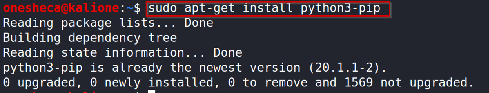

## Getting started with Scapy

Scapy is a powerful **Python-based** interactive **packet manipulation** program and library. It was originally written by Philippe Biondi.

Scapy helps to forge or decode packets of a wide number of protocols, send them on the wire, capture them, store or read them using pcap files, match requests, and a lot more.

Scapy allows the construction of tools that can easily scan or attack networks.

<a href="https://scapy.net/">https://scapy.net/</a>

Now let’s check this out!

- Installation and Launch
- Exploring Scapy
- Sniffing
- Reading PCAPs
- Crafting and Sending Packets

## Installation and Launch

**Installing Scapy**

In Kali Linux, Scapy comes **pre-installed**

We will still see the manual steps to install it on our own.
<!-- /wp:paragraph -->

Step I: Make sure your environment is updated.

Use the command:

```bash
sudo apt-get update
```
<!-- /wp:paragraph -->

Step II: Install pip (if not installed already) using the command:

```bash
sudo apt-get install python3-pip
```
<!-- /wp:paragraph -->



(It will show like above if it’s already installed in your system, otherwise the newest version of pip will get installed)

Step III:  Now install Scapy using pip:

```bash
pip install scapy
```


Scapy is now successfully installed.

**Launching Scapy**

Open the command line, and simply launch Scapy using the command scapy


The launched environment of scapy will look like this:


Now let’s start exploring scapy.

## Exploring Scapy

Scapy supported protocols

List of all the protocols supported by scapy can be viewed using the command ls().


**List of all scapy commands**

List of all scapy commands with their functionalities can be seen using the command: lsc().


**Getting HELP**

We can check the working of any function by specifying the function name in the command: 

```python
help({function_name})
```

For ex- Let’s check how to work with the function ‘tshark’.


Result will come out to be like:


## Sniffing

sniff() function can be used for sniffing the traffic. Sniffing is basically monitoring and capturing of data packets that are being passed through a computer network.
Now we will try sniffing some traffic.

( Note: To sniff traffic, you need to have admin privileges, so when you launch scapy, launch it as sudo scapy)

Now just call the sniff function and mention the number of packets you want to capture in count.
Ex- sniff(count=5)

Refresh your browser to generate some traffic from the web browser and then run the command


Here it is showing it captured 3 UDP packets and 2 of other types.

We can also take a look at the details of these packets.
Take any variable and assign _ (underscore) to it.

```python
s=_    
```

This will load the packets into variable s.
Now have a look at the packets using the summary function.

```python
s.summary()
```


It’s showing each packet’s detail on a single line.
It’s basically showing the layer of packets.
In Ist packet- at first as you see it’s ether, which means it is an ethernet frame at the Network layer.
At the network layer, an IP packet and at the transport layer - UDP.
Raw data is being received at the last application layer.
In the same way, 5 packet’s details have been captured.

To make the process simple, this whole process can be done with the help of lambda function in a single line

```python
sniff(count=4,prn=lambda x:x.summary())
```

**prn** - returns a list of packets filtered with lambda.
**lambda** - A specialized python function which can take any number of arguments in a single line, but can only have one expression(here argument taken is x and expression is x.summary() ).


**Continuous sniffing**
There is also a way to capture packets continuously, or to do continuous sniffing of traffic.
For that, despite using count, we will use iface ( that is short for interface ) and will mention the name of network interface ( virtual machine of kali uses “eht0” ), so our command will be:

```python
sniff(iface="eth0", prn=lambda x:x.summary())
```

(This will capture continuous list of packets till you either press ctrl+c or stop browsing web)

## Reading PCAPs

**pcap files**: pcap files are a record (collection) of packet data that has been pulled from a network scan.
These files are mainly associated with Wireshark - an open source program used for analyzing packets.

So our first step before reading a pcap file would be to make a pcap file using Wireshark.

**Installing Wireshark**

Install wireshark in your system using the command -

```bash
sudo apt-get install wireshark
```


(This is showing already the newest version, but if not the same in your case, it will simply install the newest version of wireshark)

**Generating pcap file**

Step I: Open Wireshark: sudo wireshark and select the network interface of your system ( default eth0 for Kali Linux).


Step II: Start capturing packets by clicking the Start (blue) button (below file).


Stop capturing after some time by clicking the Stop (red) button.

Step III: Save the file with the extension .pcap.


The pcap file has now been generated successfully.

**Reading pcap file**

Step I: Start scapy using the command scapy.
Now read the pcap file using the function rdpcap (function to read pcap file).
Mention the file location in rdpcap function and save it in a variable:

```python
x=rdpcap(“{pcap file location}”)
```

Step II: Now check out different details about packets captured.

1. Specify the variable in which the result of rdpcap was stored. This will show the summary about the number of TCP,UDP,ICMP and other packets in our pcap file.


2. To check out the brief details of any one packet, just mention the position of that packet in pcap file (stored in a variable) and assign this to some other variable like this:

```python
pkt = x[212]
```

Now call out this new variable and you will see all the details of the 212th(just an example) packet.

```python
pkt
```


3. You can also see a detailed (descriptive) view of the packet by using the function show().

```python
pkt.show()
```

This will show a full description of packet’s each and every layer one by one.


## Crafting and Sending Packets

Scapy is most popularly used for crafting and layering custom packets. You can create and send packets customized for particular needs, whether it is stimulating traffic or network testing.

It is a very powerful application and probably the coolest part of scapy.

**Creating 1 layer packet**

Open Scapy with admin privileges using `sudo scapy`
Now, let’s create a network layer packet - an IP packet.
Just write the type- IP with opening and closing parenthesis:

```python
IP()
```

This will give us a default IP packet with default settings.


**Creating multi layered packet**

Now, let’s layer an IP packet with the next protocol layer - the transport layer.
The simple and basic rule for adding layers is to use forward slash and add layers.
So add the next layer - UDP() after IP() and a forward slash:

```python
IP()/UDP()
```

(Notice now IP has fragment field set to 0 and has protocol as UDP and then our next layer is UDP)
Hola! A multi layered packet has been successfully created.

Let’s add some more layers to our packet.
Add ethernet as the starting layer as Ether() and after UDP(transport layer), add some raw data with keeping in mind the basic rule of adding forward slash after every layer:

```python
Ether()/IP()/UDP()/”Hello”
```


(Ether’s type field is ipv4, thus, pointing to the next upper layer IP)

**IP with Destination and Source**

IP’s destination via dst  and source via src can also be mentioned in the IP layer of the packet.
Eg - IP(dst=”127.0.0.1”) 
(127.0.0.1- Local (loopback) address )


Now that we know how to create packets, let’s see how to send them.

**send() function**

send() function is used to send packets at layer 3 (network layer) to the required destination.
To use this, just insert your packet into the send() function.
Let’s take a simple packet - IP(dst=”127.0.0.1”)

So now to send this packet:

```python
send(IP(dst=”127.0.0.1”))
```

(127.0.0.1 is a loopback address).
Before sending this (pressing enter), go to wireshark and start capturing packets on loopback interface.


After selecting Loopback:lo, press start (blue) button.
Now send the packet using scapy’s send function.


Now if we go over to wireshark, we can see the packet being reflected with the correct destination.


Let’s add some more layers to the packet and send it again.
Let’s add a UDP (transport layer) and some raw data in the packet:

```python
send(IP(dst=“127.0.0.1”)/UDP()/”Hello”)
```

Send this by pressing enter.


Sent successfully. See the packet captured at wireshark.


Now stop capturing by pressing the stop(red) button.

**sendp() function**

The sendp() function is used to send packets at layer 2 (ethernet layer).

Format: sendp(Ether()/{“Raw data”},iface={“”},return_packets=Boolean )

iface- It’s the Network Interface ( eth0 by default for Kali Linux)
return_packets- This returns the sent packet brief detail to scapy if value assigned is TRUE.
To see the packet, open wireshark.
Select Interface as eth0 at start.


Now press the start (blue) button to start capturing packets.
At scapy, enter following:
sendp(Ether()/”This is demo”,iface=”eth0”,retrn_packets=TRUE)
Then press enter.

Packet sent successfully.
(Destination will be ‘Broadcast’)
See the packet captured at wireshark.


Packet captured successfully.

**sr() function**

This function is for sending packets and receiving answers.
This function returns packets and answers, and also unanswered packets too.
sr1() is a variant of sr(), that returns only one packet that answered the packet sent.
The sr() packets are layer 3 (network layer) packets.
Ex- sr1(IP(dst=”127.0.0.1”)/UDP()/”Hello”)
On pressing enter, the packet will be sent and an answer will be received too whose details will be reflected.


## Summary

Scapy is a powerful tool for packet manipulation written in Python. It comes pre-installed in Kali Linux. We have seen basic functions of scapy such as sniffing using sniff() function, reading pcap files using rdpcap() function, creation of manipulated packets, and sending and receiving packets using send(),sendp() and sr() functions. Scapy can be used to handle many things like scanning, tracerouting, probing, unit tests, attacks, and network discovery.

## References

- https://scapy.readthedocs.io/en/latest/
- https://santanderglobaltech.com/en/guide-using-scapy-with-python/
- https://resources.infosecinstitute.com/topic/what-is-scapy/
- https://0xbharath.github.io/art-of-packet-crafting-with-scapy/index.html
