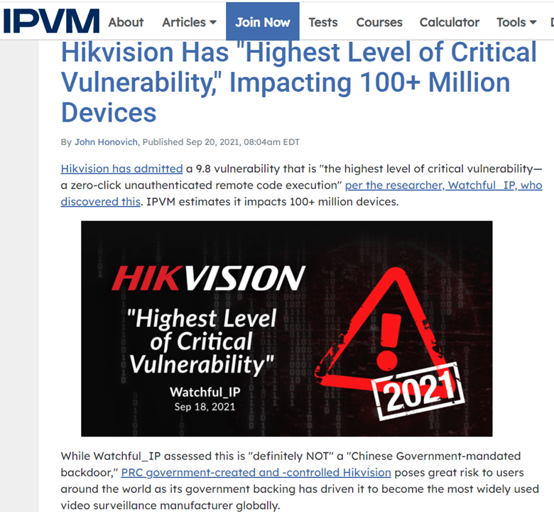
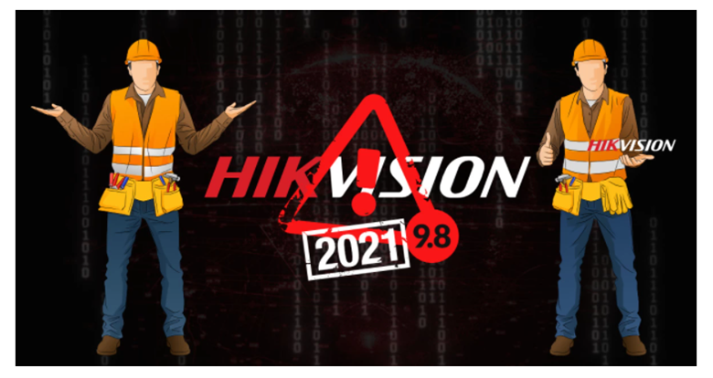
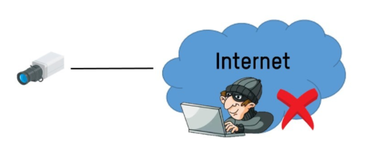

Internet Protocol (IP) cameras are an important component of state-of-the-art video surveillance systems. Unlike analog closed-circuit cameras, IP security cameras, which send and receive data through a computer network and the Internet, offer businesses a number of benefits. These benefits include the ability to monitor and control their video surveillance system remotely and a significant cost savings by allowing cloud storage of video files. However, like any device that is plugged into the Internet, without proper attention to cybersecurity, the same IP security cameras you have installed to improve security in your business may, in fact, be making it more vulnerable to physical and network attacks.

## What are Hackers Looking For?

Hackers look for vulnerabilities to exploit, usually for malicious purposes. There are plenty of reasons why hackers might want to break into your IP security camera surveillance system, including some that promise potentially huge rewards:

- They may be planning a burglary or a physical attack on your building or its occupants. If they can break into your network cameras, they can observe your physical security practices, including when guards come and go and where there are opportunities to enter the building. Once they know where and when to break in, your entire facility and all of its occupants are at risk.
- They may want to take advantage of your business computing resources, such as your network’s processing power, for the purpose of stealing large data sets or more recently, mining cryptocurrencies.
- To steal high-value trade secrets to sell to your competitors on the black market.
- To steal personal information for the purposes of conducting phishing attacks to obtain credit card and banking information from individuals.
- To install malware, such as keyloggers, to capture passwords as they are entered or ransomware that takes your system hostage until you pay the hacker to release it.

## Are Your IP Security Cameras Vulnerable?

The short answer is yes. All security cameras are vulnerable to hacking. The unfortunate reality is that in today’s cybersecurity environment, the question is not whether your system will be hacked but when, which makes ongoing and proactive cybersecurity measures a must.

Hackers can break into your video surveillance system in a variety of ways. In addition to hacking the cameras themselves, they can get into your network through:

- The computer operating system you use (e.g. Microsoft Windows, Linux, etc.)
- The software your system uses, including digital video recording (DVR), network video recording (NVR), or video management system (VMS) software
- Any firewall ports you may be using to access the system controls

Given these additional entry points, the security of your IP cameras depends not only on the cameras you use but also on the network technology and configuration of your system. In general, the relative security the system provides depends on how access is configured:

**Most Secure** — The safest system uses the local network equipped with a network firewall and virtual private network (VPN) software for access. With this type of system, the only way to get through the firewall is through a secure, encrypted connection. 

An alternative to this would be to use a cloud-managed IP security camera. With this type of system, rather than opening the firewall and relying on a password to gain access to the camera on a local network, cloud-managed IP cameras are configured to communicate with a secured server in the cloud over an encrypted connection, and users gain access by linking up their devices with those servers. Cloud-managed devices offer a good alternative to locally networked systems because most cloud services monitor their servers continuously.

**Least Secure** — The least secure type of IP security camera is used in conjunction with a system that relies on port forwarding (China based OEM propose) for access, which allows users to access the camera through a network firewall with nothing other than a password. With this type of system, the only thing keeping a hacker out is the strength of the password used.

## How to Protect Your IP Security Cameras?

One of the most important things you can do to protect your IP security cameras is to know what you have and whether there are any known vulnerabilities. The CVE Security Vulnerabilities Database is a great place to start. This site tracks the vulnerabilities of all kinds of Internet of Things (IoT) devices and is searchable by the vendor (manufacturer), product and version, specific vulnerabilities and their severity. When checked regularly, this information can help you identify and address new issues with your IP security cameras so that you can address them more quickly.

A comprehensive set of cybersecurity best practices can go a long way to improving the security of your IP security cameras and your video surveillance system as a whole:
- Contain and compartmentalize your internal networks. Creating separate networks for your video surveillance system and your information systems not only saves on bandwidth, but also minimizes risk should any part of your system be compromised.
- If you are not already using a firewall, implement one as soon as possible.
- Use a unique, long, and non-obvious password for each camera. This is critical if you are allowing access with a port forwarding system. If your system employs a VPN, however, having a single strong password for all cameras will suffice.
- Change all passwords every 90 days at a minimum.
- Enable two- or multi-factor authentication for your system, which requires the user to provide another piece(s) of information unique to the user, such as a code sent via text or phone, secret questions, etc. This is critically important if you are using a port forwarding system.
- Develop and document cybersecurity guidelines and provide cybersecurity training to all employees who will have access to your video surveillance system.
- Establish a cybersecurity incident response team so that you can swiftly and effectively respond to any breaches.
- Stay on top of the operating system and software updates and apply them promptly when they come out.
- If you use a cloud-based system, make sure you use a trusted provider.
- Stay up-to-date with the latest cybersecurity standards.

Cybersecurity concerns are a long-standing issue for Hikvision, e.g., it was US government federally banned by the 2019 NDAA and the US government is planning to ban FCC authorizations for Hikvision, so this admission comes at a critical time for the company.

Researcher describes only access to the http(s) server port (typically 80/443) is needed. No username or password needed nor any actions need to be initiated by camera owner. It will not be detectable by any logging on the camera itself. This is the worst Hikvision vulnerability since Hikvision's backdoor was discovered in 2017 where Hikvision included a magic (ostensibly secret) string that allowed anyone with that string to perform admin operations, without having the device's admin credentials.

The attack can be executed via HTTP (port 80) or HTTPS (port 443). Once a camera has been compromised, the attacker can use it as a starting point to explore the rest of a victim’s network. Past attacks on connected cameras have also sought to enlist the devices into botnet armies capable of launching massive DDoS (distributed denial of service) attacks or spam campaigns.
This vulnerability is about as serious as they come, rated 9.8 out of 10 on the Common Vulnerability Scoring System (CVSS).

IPVM estimate 100+ million devices globally are impacted by this vulnerability making it, by far, the biggest vulnerability to ever hit video surveillance. The combination of its critical nature (9.8 / "zero-click unauthenticated remote code execution") and Hikvision's massive market size make this risk unprecedented.
For background, back in 2016, Hikvision said they manufactured "more than 55M cameras" and the annual output has grown substantially since. Hikvision has therefore shipped a few hundred million cameras and tens of millions of recorders during the time frame the vulnerability covers.

The end-users who buy these cameras are responsible for the data/video footage they generate. They are, in other words, the data custodians who process the data and are in control of the video footage, which is required to be kept private by law (under the GDPR). Secret access to video footage on these devices is impossible without the consent of the end-user.

Dahua is another in Ban list. Watch https://youtu.be/MtkeaoS3jBc

## Keeping Up with Cybersecurity Threats Can be Daunting
Hackers are relentless in their attacks and there is not a single industry today that is immune to them. Almost half of all cybercrimes are committed against small businesses, and it has been predicted that a business will fall victim to a ransomware attack every 14 seconds by 2019.
If you need help with your video surveillance system, SSA Integrate can help. Our security experts stay on top of the technology and all the best practices in cybersecurity so you don’t have to. We give importance of our customer data security.
If you are installing a new video surveillance system, we can help you select the right technology to meet your needs and ensure it is properly configured to provide the top level security you expect. We can also look at your current system to identify and eliminate any vulnerabilities and provide the monitoring and updates you need to keep your system secure. Whether you need five cameras or 500, SSA Integrate can help. Contact us today to learn more.

## References

- https://www.forbes.com/sites/leemathews/2021/09/22/widely-used-hikvision-security-cameras-vulnerable-to-remote-hijacking/?sh=138e83062f31
- https://ipvm.com/reports/hikvision-36260
- https://cve.mitre.org/cgi-bin/cvename.cgi?name=CVE-2021-36260
- https://watchfulip.github.io/2021/09/18/Hikvision-IP-Camera-Unauthenticated-RCE.html
