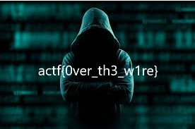

## What is Network Forensics?

This branch of digital forensics basically deals with the monitoring and analysis of a computer network. This is mainly for the purpose of information gathering, legal evidence, or intrusion detection. Network forensics generally has two uses. The first, relating to security, involves monitoring a network for anomalous traffic and identifying intrusions.&nbsp;

## Why do we need Network Forensics?

An attacker might be able to erase all log files on a compromised host, network-based evidence might therefore be the only evidence available for forensic analysis. In this case, analysis of captured network traffic can include tasks such as reassembling transferred files, searching for keywords, and parsing human communication such as emails or chat sessions. The network traffic can give us a lot of clues like, The websites that the attacker communicated with, The files transferred(which includes bank details, chats, pictures, etc.), It can also include evidence about the activity of certain types of malware. In a computer network, the data is transferred across as packets.

## What is a PCAP?

PCAP files are data files that have the data of a network session. These files contain data regarding what kind of connection was established between the hosts, how did the attacker penetrate the system(in case of an intrusion), all data that was transferred through the network, like files transferred, etc are all recorded and kept. Hence they are analyzed thoroughly for clues regarding an attack. Commonly used tool for analyzing a PCAP file in [Wireshark](https://www.wireshark.org/)

## An initial approach to analyze PCAP

For initial analysis, take a high-level view of the packets with Wireshark's statistics or conversations view. <strong>Wireshark</strong>, and its command-line version <strong>tshark</strong>, both support the concept of using<strong> "filters"</strong> which, if you master the syntax, can quickly reduce the scope of your analysis.&nbsp;

Just as "file carving" refers to the identification and extraction of files embedded within files, "packet carving" is a term sometimes used to describe the extraction of files from a packet capture.

A<strong> note</strong> about <strong>PCAP vs PCAPNG</strong>: there are two versions of the PCAP file format; PCAPNG is newer and not supported by all tools. You may need to convert a file from PCAPNG to PCAP using Wireshark or another compatible tool, to work with it in some other tools.

## Basic Wireshark Usage

To install Wireshark give the following command :&nbsp;

```bash
sudo apt install wireshark-qt
```

### Let's try analyzing a pcap file

This challenge came as part of a high school CTF(Angstrom CTF 2018).

#### Step 1

By loading the pcap file in Wireshark, we observe the given is a pcap file that has many protocols like DNS, ICMP, TCP, etc.


The two rows below the packet list show us details regarding the packet structure and also the buffer data in each packet respectively. The first row shows the packet structure of each packet in a capture.

The second row shows the buffer data that is transferred through the network in each packet.&nbsp;

#### Step 2

For any transfer of packets occurring in a network each of the packets transferred has a hierarchy of layers followed as per the OSI model for a network. Wireshark allows you to examine the protocol hierarchy of a packet capture. For doing so go to <strong>Statistics&gt;&gt;Protocol hierarchy</strong> on the toolbar.&nbsp;


#### Step 3

Since <strong>HTTP protocol</strong> is concerned with specifying the format and transmission of messages, the chance of any<strong> multimedia being transferred</strong> in these packets is high. Hence using Wireshark we can analyze and dump if any multimedia is transferred through these packets.&nbsp;

For doing so go to: <strong>File&gt;&gt;Export Objects&gt;&gt; HTTP</strong>


This a list of all multimedia files transferred in this stream of HTTP packets. By saving this image and opening we get the flag as the image.



## Basic Tshark Usage

<strong>Tshark</strong>, a well-known and powerful <strong>command-line tool </strong>and is used as a network analyzer. It is developed by Wireshark. Its working structure is quite similar to Tcpdump, but it has some powerful decoders and filters. TShark is capable of capturing the data packet information of different network layers and display them in different formats.

### List interfaces

TShark prints a list of the interfaces whose traffic it can capture. Each interface is referred to by its serial number and as you can see it is followed by a text description of the network interface. These interfaces can be specified using the<strong> -i parameter</strong>; which is used to specify the network whose traffic we want to capture.&nbsp;

And to check out these interfaces you can use the <strong>parameter -D</strong>


### Capture traffic

We have various choices of the interface to capture traffic and therefore one can choose whichever depending on their needs and requirements . But in our scenario, the interface which we are going to use is “enp1s0”


### Output formats

For our convenience, in tshark, we have -T option that lets us save decoded packets in various output formats. It can set the format of the output in a way that it becomes easy to understand.&nbsp;


## Other Tools

### Dumpcap

Dumpcap is a network traffic dump tool. It captures packet data from a live network and writes the packets to a file. Dumpcap’s native capture file format is pcapng, which is also the format used by Wireshark.

### Tcpdump

Tcpdump is a command-line utility that allows you to capture and analyze network traffic going through your system. It is often used to help troubleshoot network issues, as well as a security tool.

## Conclusion

Analyzing a packet capture file PCAP is a matter of thinking about the problem logically, reasoning what information you are looking for, and then constructing search filters to suit your requirements. Our Telnet example was very basic as it did not require any conversions or decryption, but again, the same principles would apply.

There is a lot that can be done with Wireshark, and it’s definitely a tool that you should at least be familiar with installing and running, even if you are not using it every day. It can help with an investigation into a fault and is a brilliant starting point: the PCAP results that you get on your network can tell you a lot about what is happening around you, especially if you have reasons to be suspicious about any strange activity.