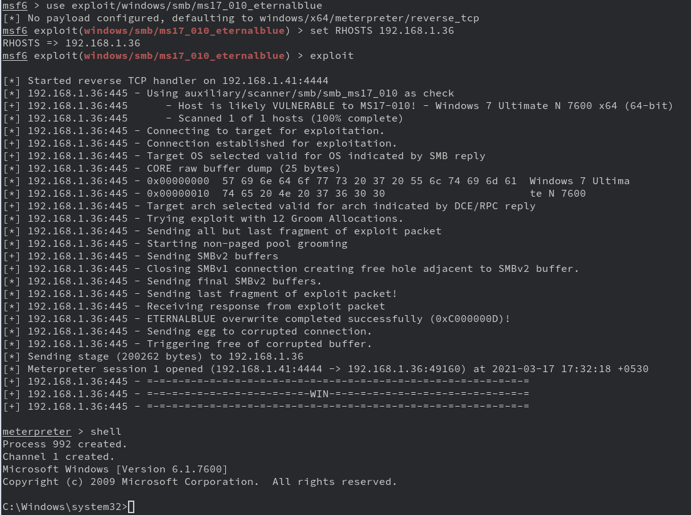
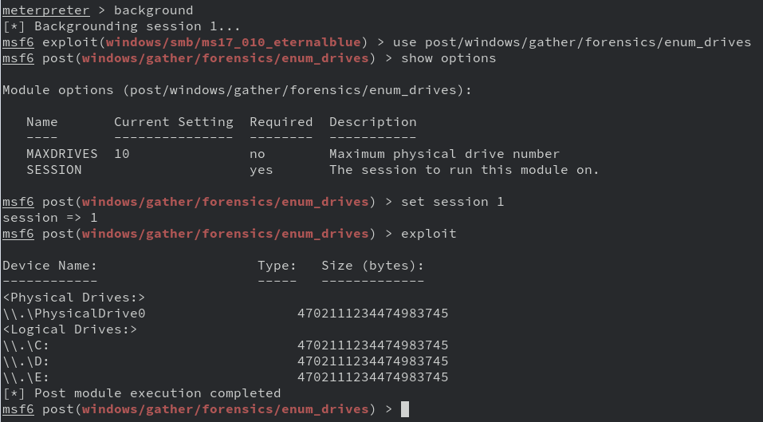
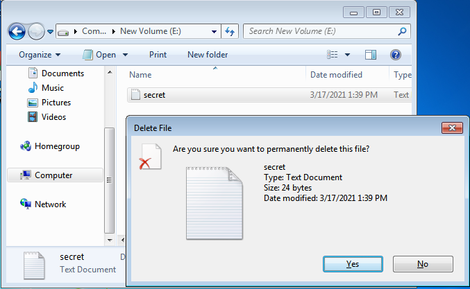
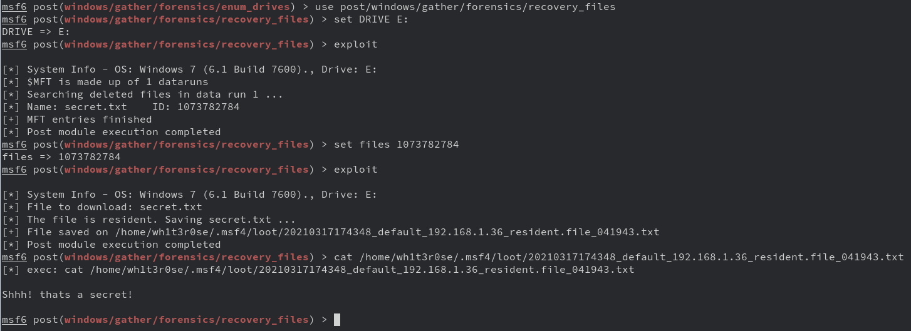
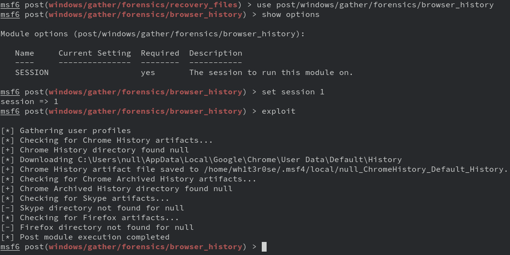
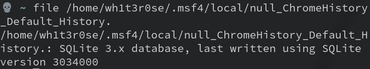
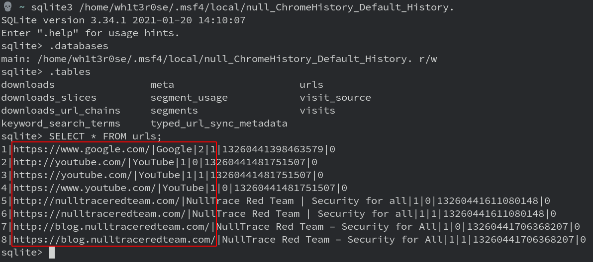

## Introduction

Sometimes getting close to a target may not be a good idea due to certain reasons. But remotely hacking and gaining access to the target system can be a bonus since we won't have to touch the target's computer and also no one saw us near it.

Metasploit with the help of a **meterpreter** on a system can be used to do many things. Today's article or post is going to deal with recovering deleted files and browser history on a target's device.

## Prerequisite

The blog assumes you have a meterpreter on the system and full system access. I used a windows 7 virtual machine and used [Eternal Blue CVE](https://www.rapid7.com/db/modules/exploit/windows/smb/ms17_010_eternalblue/) to get a meterpreter shell.

## Investigating Windows

### Step 1

We need to know the drives and devices mounted on the target system to enable us to know which one we are going to recover the deleted files from. For this, we run a post-module called **enum_drives** in the Metasploit post forensics folder.

First, we need to background our session using **background** command in the meterpreter console. We can later get back to the meterpreter by using **sessions -i &lt;meterpreter id&gt;** where &lt;meterpreter id&gt; is the id of our background meterpreter.

And then use the post-module

We can see three drives to be mounted on the victim machine.

### Step 2

Now we need to recover the deleted files from the victim’s computer. For this, we run a post-module called **recovery_files** in the Metasploit post forensics folder.

First, let us delete a file from the virtual machine to test this post-module.

Here we permanently deleted a **secret.txt** in the **E:\ drive.**

Now let’s recover this file using **recovery_files** post-module.

To save a recovered file, we type **FILES** followed by the **image id**. The image id is the **ID:** specified beside the image

### Step 3

To get Browser’s history from the victim’s computer, we will use a post-module called browser_history in the Metasploit post forensics folder.

It saved the Artifact file in the .msf4 local directory, on running the file command on the file we get to know it’s a sqlite3 DB file.

Now let’s use sqlite3 command-line shell to access the data inside it.

Using a simple SQL query command on the urls table dumps all the URLs victim has visited.

## Conclusion

The goal of computer forensics is to examine digital media in a forensically sound manner with the aim of identifying, preserving, recovering, analyzing, and presenting facts and opinions about digital information.

The backdoor shells are now not just a way to access data but to do various kinds of analysis on the machine remotely. Like in this blog we examined a windows machine without physically tampering with it.
